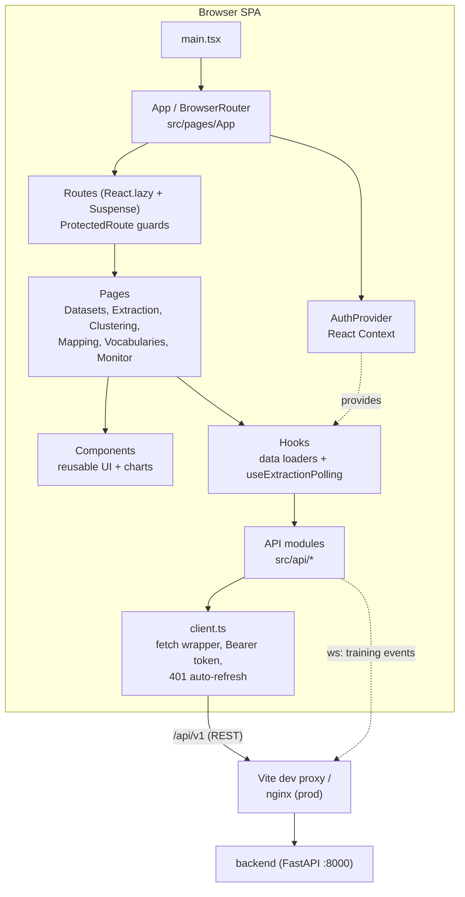

# Architecture

The one-page map of the frontend SPA: its major subsystems, how they connect, and
where to jump next. For the cross-service picture (backend, bioner, data stores) see
the repository root `CLAUDE.md`.

## What this is

A React 19 + Vite single-page app for the **extract → cluster → map** workflow:
upload a dataset of unstructured medical text, extract source terms via NER, cluster
similar terms, then map them to OHDSI standard concepts. It is a pure client — all
persistence and compute live in the backend; the frontend holds only view state.

## System map

## Subsystems

| Subsystem | Where | Job | Deep dive |
|---|---|---|---|
| Entry & routing | `src/main.tsx`, `src/pages/App/` | Mount React, define lazy routes, guard them | [background/routing-and-auth.md](./background/routing-and-auth.md) |
| Auth | `src/hooks/useAuth.ts`, `src/components/AuthProvider/`, `src/components/ProtectedRoute/` | JWT session state, login/logout, route protection | [background/routing-and-auth.md](./background/routing-and-auth.md) |
| API layer | `src/api/` | Typed `fetch` client + one module per backend domain; token attach & 401 refresh | [background/api-layer.md](./background/api-layer.md) |
| State & hooks | `src/hooks/` | Data loaders, extraction-job polling, toasts; component-local `useState` | [background/state-and-hooks.md](./background/state-and-hooks.md) |
| Pages / workflow | `src/pages/` | The extract → cluster → map screens plus vocabularies & monitoring | [workflow.md](./workflow.md) |
| Components | `src/components/` | Reusable UI (Button, Table, drag-drop cluster cards, charts) | [components.md](./components.md) |

## How a request flows

1. A **page** renders and calls a **hook** (e.g. `useDatasets`) inside `useEffect`.
2. The hook calls a typed function from an **API module** (`src/api/datasets.ts`).
3. That function calls `apiRequest()` in `src/api/client.ts`, which attaches the
   `Authorization: Bearer <access_token>` header and issues a `fetch` to `/api/v1/…`.
4. In dev, Vite proxies `/api` to the backend (`BACKEND_HOST`); in prod, nginx does.
5. On `401`, the client transparently refreshes the token and retries once; if the
   refresh token is also invalid it throws `"Session expired…"`, which the auth layer
   treats as logout.

## Key entry points

- `src/main.tsx` — React root, imports global tokens `src/index.css`.
- `src/pages/App/index.tsx` — router; every route except `/login` is wrapped in
  `ProtectedRoute`; unknown paths redirect to `/datasets`.
- `src/api/client.ts` — the single choke point for every REST call and the token
  refresh logic.
- `src/api/index.ts` — barrel re-exporting all API modules (import from `@/api`).
- `vite.config.ts` — dev server port, `/api` proxy, and the two Vitest projects.

## State model in one line

React Context holds **only** auth; everything else is component `useState` fed by
custom hooks. No Redux/Zustand/SWR/react-query. Refetching is manual — hooks expose
refresh callbacks the pages call after a mutation. See
[background/state-and-hooks.md](./background/state-and-hooks.md).
